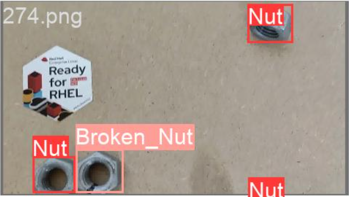

## Download the Jupyter Lab

[Train_Nut](Train_Nut.ipynb)


## Clone the Repository

This cell clones the repository from the URL "https://github.com/bdherouville/redhat-edge-ai-industrial-demo.git" using the `git clone` command. The repository contains the code and data for the Red Hat Edge AI Industrial Demo.

```
!git clone https://github.com/bdherouville/redhat-edge-ai-industrial-demo.git
```


## Clone the YOLOv5 Repository

This cell clones the YOLOv5 repository from the URL "https://github.com/ultralytics/yolov5" using the `git clone` command. YOLOv5 is a popular object detection algorithm used for training and inference on image and video data.

```
!git clone https://github.com/ultralytics/yolov5 
```

## Modify the YOLOv5 Requirements

This cell modifies the YOLOv5 requirements by replacing the package `opencv-python` with `opencv-python-headless` in the `requirements.txt` file. This modification is done to make Jupyter able to run the python opencv code.

```
!cd yolov5 && sed -i s/'opencv-python>'/'opencv-python-headless>'/g requirements.txt
```

## Uninstall OpenCV Packages

This cell uninstalls the OpenCV packages `opencv-python` and `opencv-python-headless` using the `pip uninstall` command with the `-y` flag for automatic confirmation. This step ensures that any existing installations of OpenCV packages are removed.

```
!pip uninstall -y opencv-python opencv-python-headless
```

## Install YOLOv5 Requirements

This cell installs the required packages for YOLOv5 by running the `pip install` command with the `-r` flag and specifying the `requirements.txt` file. This step ensures that all the necessary dependencies for YOLOv5 are installed.


```
!cd yolov5 && pip install -r requirements.txt  # install
```

## Train the Model

This cell navigates to the `yolov5` directory and runs the command `python train.py` to start training the YOLOv5 model. The training process is performed with specific settings such as image size set to 1280, number of epochs to 10, batch size 10, dataset location, and pre-trained weights.


```
!cd /opt/app-root/src/yolov5 && python train.py --img 1280 --epochs 10 --batch-size 10 --data /opt/app-root/src/redhat-edge-ai-industrial-demo/dataset/images_annotated/YOLODataset/dataset.yaml --weights yolov5s.pt
```


## Move the Best Model

This cell finds the file named `best.pt` in the current directory and moves it to the directory `/opt/app-root/src/redhat-edge-ai-industrial-demo/model/nut.pt`. This step is performed using the `find` command combined with the `mv` command. The `best.pt` file represents the trained model with the best performance during training and is renamed as `nut.pt` in the target directory for further usage.
